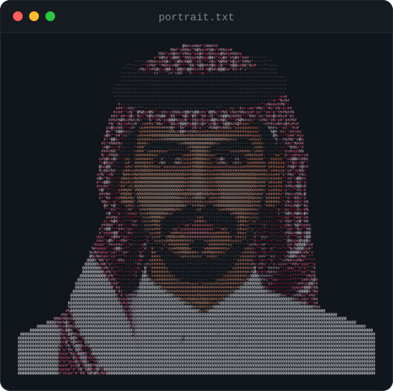

<table>
<tr>
<td valign="top"></td>
<td valign="top"></td>
</tr>
</table>

### About

Software engineer and business analyst who starts from the problem, not the code. I sit with stakeholders, turn what they picture into clear requirements, then build, test, and ship software people just use without anyone explaining it. Currently at **Sanal AI**, delivering frontend features for web and merchant apps, and freelancing for **Jzaa Agency**, where I own their website from requirements to maintenance. I automate the busywork in between with **n8n**.

### Journey

### Featured Projects

<table>
<tr>
<td width="50%">
<a href="https://bucolic-stroopwafel-3bcb42.netlify.app/"><b>Live demo</b></a> · <a href="https://github.com/Hashim0011/faten-platform">Source code</a>
</td>
<td width="50%">
<a href="https://hashim0011.github.io/dashy-ai/"><b>Live demo</b></a> · <a href="https://github.com/Hashim0011/dashy-ai">Source code</a>
</td>
</tr>
<tr>
<td width="50%">
<a href="https://hashim0011.github.io"><b>Live demo</b></a> · <a href="https://github.com/Hashim0011/hashim0011.github.io">Source code</a>
</td>
<td width="50%">
<a href="https://hashim0011.github.io/foodie-flow/"><b>Live demo</b></a> · <a href="https://github.com/Hashim0011/foodie-flow">Source code</a>
</td>
</tr>
</table>

### Tech Stack

